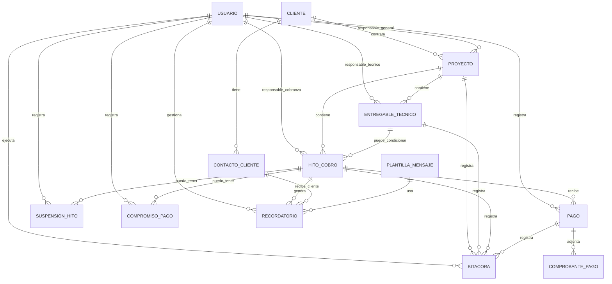

````md
# IASSAT PayFlow

IASSAT PayFlow es un MVP de gestión de cobranza por hitos para empresas de servicios profesionales B2B.

El sistema permite controlar proyectos, entregables técnicos, hitos de cobro, pagos parciales, compromisos de pago, suspensiones, recordatorios y trazabilidad interna. Su objetivo principal es ayudar a una empresa a saber qué cliente debe pagar, cuánto debe, cuándo vence, quién debe hacer seguimiento y qué hitos todavía no deben cobrarse.

> Este proyecto está enfocado como MVP/demo comercial para validar la idea con usuarios reales antes de construir una solución más grande tipo ERP.

---

## Problema que resuelve

Muchas empresas de servicios trabajan con pagos por etapas:

- Adelanto inicial.
- Pago contra entrega de un informe.
- Pago contra aprobación del cliente.
- Pago contra aprobación de una entidad.
- Pago programado por fecha.
- Pago final al cerrar el proyecto.

El problema aparece cuando no existe control claro sobre:

- Qué hitos ya son cobrables.
- Qué hitos siguen bloqueados.
- Qué entregables están pendientes.
- Qué clientes están en mora.
- Qué pagos fueron parciales.
- Qué comprobantes están pendientes de revisión.
- Qué usuario debe hacer seguimiento.
- Qué recordatorios ya fueron enviados.

IASSAT PayFlow busca ordenar ese flujo en una sola plataforma.

---

## Objetivo del MVP

El MVP permite:

- Registrar clientes y contactos.
- Crear proyectos.
- Definir entregables técnicos si aplican.
- Crear hitos de cobro vinculados o no a entregables.
- Controlar estados financieros de cada hito.
- Registrar pagos parciales o totales.
- Adjuntar comprobantes de pago.
- Registrar compromisos de pago.
- Suspender hitos cuando no deben cobrarse.
- Generar o programar recordatorios.
- Mantener una bitácora de eventos importantes.
- Visualizar KPIs básicos de cobranza.

---

## Concepto principal

El centro del sistema es el **Hito de Cobro**.

Un proyecto puede tener varios entregables y varios hitos, pero el dinero se controla desde los hitos.

Ejemplo:

```txt
Proyecto: Servicio técnico ambiental
Monto total: S/ 10,000

Hito 1: Adelanto inicial
Monto: S/ 3,000
Activación: Firma de contrato

Hito 2: Entrega de informe técnico
Monto: S/ 4,000
Activación: Entregable aprobado

Hito 3: Aprobación final
Monto: S/ 3,000
Activación: Aprobación del cliente
````

No todos los hitos dependen de un entregable. Algunos pueden activarse por firma de contrato, fecha programada, aprobación del cliente o activación manual.

---

## Tech Stack

* **Frontend:** Next.js 16, React 19, TypeScript, Tailwind CSS 4, shadcn/ui
* **Backend:** Next.js API Routes
* **ORM:** Prisma
* **Database:** SQLite para desarrollo MVP
* **Testing:** Jest, Playwright
* **Package Manager:** pnpm

---

## Módulos del MVP

### 1. Clientes

Permite registrar empresas o personas que contratan servicios.

Incluye:

* Razón social.
* Documento.
* Teléfono principal.
* Email principal.
* Dirección.
* Estado del cliente.

Un cliente puede tener varios proyectos y varios contactos.

---

### 2. Contactos del cliente

Permite registrar a las personas que reciben comunicaciones o recordatorios.

Ejemplo:

* Gerente general.
* Encargado de pagos.
* Administrador.
* Contacto de cobranza.

Esto evita depender de un solo teléfono o correo por cliente.

---

### 3. Proyectos

Representan los servicios contratados por el cliente.

Incluye:

* Cliente.
* Responsable general.
* Código.
* Nombre.
* Descripción.
* Monto total.
* Moneda.
* Fecha de inicio.
* Fecha estimada de fin.
* Estado del proyecto.

Estados del proyecto:

```txt
Borrador
EnCurso
Pausado
Finalizado
Cancelado
```

---

### 4. Entregables técnicos

Representan el trabajo técnico que debe producir el equipo.

Ejemplos:

* Informe técnico.
* Plano.
* Expediente.
* Sustento.
* Documento final.
* Aprobación de una entidad.

Estados técnicos:

```txt
Pendiente
EnCurso
Terminado
Observado
Subsanacion
Aprobado
```

Regla importante:

> Un entregable técnico no es dinero.
> Un entregable puede activar un hito de cobro, pero el cobro se controla desde el hito.

---

### 5. Hitos de cobro

Es la entidad principal del sistema.

Un hito representa una obligación económica dentro de un proyecto.

Incluye:

* Proyecto.
* Entregable relacionado, si aplica.
* Responsable de cobranza.
* Contacto de cobranza.
* Nombre del hito.
* Tipo de activación.
* Monto.
* Saldo pendiente.
* Moneda.
* Estado financiero.
* Fecha programada.
* Fecha de activación.
* Fecha de vencimiento.
* Habilitación para cobranza.
* Observación.

Tipos de activación:

```txt
Adelanto
FirmaContrato
Entregable
FechaProgramada
AprobacionCliente
AprobacionEntidad
Manual
```

Estados financieros del MVP:

```txt
Bloqueado
Suspendido
Exigible
Notificado
EnMora
CompromisoPago
PagoEnRevision
PagadoParcial
Pagado
Conciliado
```

Regla crítica:

Un hito no debe generar cobranza ni recordatorios al cliente si está en:

```txt
Bloqueado
Suspendido
PagoEnRevision
Pagado
Conciliado
```

---

### 6. Pagos

Permite registrar pagos realizados por el cliente.

Incluye:

* Hito relacionado.
* Usuario que registra.
* Monto pagado.
* Monto aplicado.
* Saldo anterior.
* Saldo resultante.
* Fecha de pago.
* Medio de pago.
* Referencia de operación.
* Estado del pago.
* Observación.

Estados del pago:

```txt
Registrado
EnRevision
Observado
Validado
Conciliado
```

El sistema permite pagos parciales.

Ejemplo:

```txt
Hito: S/ 5,000

Pago 1: S/ 2,000
Saldo pendiente: S/ 3,000
Estado del hito: PagadoParcial

Pago 2: S/ 3,000
Saldo pendiente: S/ 0
Estado del hito: Pagado
```

---

### 7. Comprobantes de pago

Permite adjuntar vouchers, imágenes, PDFs o constancias relacionadas a un pago.

Incluye:

* URL del archivo.
* Nombre del archivo.
* Tipo de archivo.
* Banco.
* Número de operación.
* Fecha de subida.

---

### 8. Suspensión de hitos

Permite pausar la cobranza de un hito cuando existe un bloqueo interno o una razón válida para no cobrar todavía.

Ejemplos:

* El entregable se retrasó.
* El cliente observó el trabajo.
* Falta aprobación interna.
* Falta documentación.
* El proyecto se encuentra pausado.

Un hito suspendido:

* No se cobra.
* No genera recordatorios al cliente.
* No cuenta como cartera exigible.
* Debe tener motivo obligatorio.
* Debe tener responsable interno.
* Debe tener fecha tentativa de reactivación.

Estados de suspensión:

```txt
Activa
Subsanada
Cancelada
```

---

### 9. Compromisos de pago

Permite registrar cuando el cliente promete pagar en una fecha futura.

Incluye:

* Hito relacionado.
* Usuario que registra.
* Monto comprometido.
* Fecha prometida.
* Estado del compromiso.
* Observación.

Estados del compromiso:

```txt
Activo
Cumplido
Incumplido
Cancelado
```

Regla:

> Si el cliente incumple el compromiso, el hito puede volver a estado `EnMora`.

---

### 10. Recordatorios

Permite generar recordatorios para clientes o para el equipo interno.

Tipos de recordatorio:

```txt
ClientePorVencer
ClienteVencido
ClienteMora
EquipoCobranza
EquipoTecnico
CompromisoPago
```

Canales previstos:

```txt
WhatsApp
Email
Sistema
```

Estados del recordatorio:

```txt
Pendiente
Enviado
Fallido
Cancelado
```

Origen del recordatorio:

```txt
Manual
Sistema
N8N
```

Para el MVP, el flujo recomendado es:

```txt
1. El sistema detecta un hito relevante.
2. Se genera un recordatorio pendiente.
3. El usuario revisa el recordatorio.
4. El usuario decide enviarlo.
5. n8n puede ejecutar el envío.
6. El resultado se registra en el sistema.
7. El evento queda guardado en la bitácora.
```

---

### 11. Plantillas de mensaje

Permite definir mensajes base para comunicaciones con clientes o con el equipo interno.

Ejemplo de plantilla para cliente:

```txt
Hola {{cliente}}, le recordamos que el hito {{hito}} del proyecto {{proyecto}} tiene un saldo pendiente de {{saldo_pendiente}} con vencimiento {{fecha_vencimiento}}.
```

Ejemplo de plantilla interna:

```txt
El cliente {{cliente}} tiene el hito {{hito}} en mora. Responsable de cobranza: {{responsable_cobranza}}.
```

---

### 12. Bitácora

Permite registrar la trazabilidad del sistema.

Eventos sugeridos:

```txt
ProyectoCreado
HitoCreado
HitoActivado
HitoSuspendido
HitoReactivado
RecordatorioCreado
RecordatorioEnviado
RecordatorioFallido
PagoRegistrado
PagoValidado
PagoObservado
PagoConciliado
CompromisoRegistrado
CompromisoIncumplido
EntregableActualizado
ComentarioInterno
CambioEstado
```

Regla:

> Todo evento importante debe quedar registrado para saber qué pasó, cuándo pasó y quién lo hizo.

---

## Diagrama Entidad-Relación del MVP



---

## Reglas de negocio principales

### 1. El hito es el centro financiero

El proyecto organiza el servicio, pero el cobro se controla desde el hito.

---

### 2. No todo hito depende de un entregable

Por eso, el campo `id_entregable` debe permitir `NULL`.

Ejemplos de hitos sin entregable:

* Adelanto inicial.
* Pago por firma de contrato.
* Pago por fecha programada.
* Pago activado manualmente.

---

### 3. No cobrar hitos bloqueados o suspendidos

El sistema no debe generar recordatorios de cobranza al cliente si el hito está en estado:

```txt
Bloqueado
Suspendido
PagoEnRevision
Pagado
Conciliado
```

---

### 4. Los recordatorios pueden ser al cliente o al equipo

Un recordatorio puede estar dirigido a:

* Un contacto del cliente.
* Un usuario interno.
* Ambos casos según el flujo.

Ejemplo:

```txt
Recordatorio al cliente:
id_contacto_cliente = contacto del cliente
id_usuario_destino = null

Recordatorio interno:
id_contacto_cliente = null
id_usuario_destino = usuario de cobranza
```

---

### 5. Los pagos parciales están permitidos

Un hito puede recibir varios pagos.

Cada pago debe actualizar:

* Saldo anterior.
* Monto aplicado.
* Saldo resultante.
* Saldo pendiente del hito.

---

### 6. Toda suspensión debe tener motivo

No basta con cambiar el estado del hito a `Suspendido`.

Debe registrarse:

* Motivo.
* Responsable interno.
* Fecha tentativa de reactivación.
* Usuario que registra.

---

### 7. Todo evento importante debe registrarse en bitácora

La bitácora permite auditar:

* Cambios de estado.
* Pagos.
* Suspensiones.
* Reactivaciones.
* Recordatorios.
* Compromisos de pago.
* Observaciones internas.

---

## Funcionalidades incluidas en el MVP

* Gestión de clientes.
* Gestión de contactos del cliente.
* Gestión de usuarios internos.
* Gestión de proyectos.
* Gestión de entregables técnicos.
* Gestión de hitos de cobro.
* Estados financieros por hito.
* Registro de pagos parciales.
* Registro de comprobantes.
* Suspensión de hitos.
* Compromisos de pago.
* Recordatorios manuales o programados.
* Plantillas de mensaje.
* Bitácora de eventos.
* Dashboard básico de cobranza.

---

## Funcionalidades fuera del MVP

Para mantener el proyecto enfocado, esta versión no incluye todavía:

* Roles y permisos avanzados.
* Múltiples empresas o multi-tenant.
* Contratos.
* Propuestas comerciales.
* Conciliación bancaria automática.
* Reglas avanzadas de recordatorio.
* Etiquetas avanzadas.
* Historial de estados en tabla separada.
* Tabla general de archivos.
* Aprobaciones externas complejas.
* Aplicación móvil.

Estas funcionalidades pueden evaluarse para una versión 2.

---

## Project Structure

```txt
app/
  page.tsx                    # Dashboard principal
  clients/                    # Gestión de clientes
  projects/                   # Gestión de proyectos
  milestones/                 # Hitos de cobro
  deliverables/               # Entregables técnicos
  payments/                   # Registro de pagos
  reconciliation/             # Validación / conciliación manual
  reminders/                  # Recordatorios
  templates/                  # Plantillas de mensaje
  audit/                      # Bitácora
  api/
    clients/                  # API de clientes
    contacts/                 # API de contactos
    projects/                 # API de proyectos
    deliverables/             # API de entregables
    milestones/               # API de hitos de cobro
    payments/                 # API de pagos
    reminders/                # API de recordatorios
    templates/                # API de plantillas
    audit/                    # API de bitácora
    dashboard/                # KPIs del dashboard

lib/
  prisma.ts                   # Prisma client singleton
  utils.ts                    # Utilidades generales
  state-machine.ts            # Reglas de transición de estados
  audit.ts                    # Registro de eventos en bitácora

prisma/
  schema.prisma               # Modelo de base de datos
  seed.ts                     # Datos de prueba para demo

types/
  client.types.ts
  project.types.ts
  deliverable.types.ts
  milestone.types.ts
  payment.types.ts
  reminder.types.ts
  audit.types.ts

components/
  ui/                         # Componentes base shadcn/ui
  dashboard/                  # Componentes del dashboard
  clients/                    # Componentes visuales de clientes
  projects/                   # Componentes visuales de proyectos
  milestones/                 # Componentes visuales de hitos
  payments/                   # Componentes visuales de pagos
```

---

## API Overview

| Method | Endpoint                | Description                            |
| ------ | ----------------------- | -------------------------------------- |
| GET    | `/api/dashboard`        | KPIs generales del sistema             |
| GET    | `/api/clients`          | Lista de clientes                      |
| POST   | `/api/clients`          | Crear cliente                          |
| GET    | `/api/clients/:id`      | Detalle de cliente                     |
| PATCH  | `/api/clients/:id`      | Actualizar cliente                     |
| GET    | `/api/projects`         | Lista de proyectos                     |
| POST   | `/api/projects`         | Crear proyecto                         |
| GET    | `/api/projects/:id`     | Detalle de proyecto                    |
| PATCH  | `/api/projects/:id`     | Actualizar estado o datos del proyecto |
| GET    | `/api/deliverables`     | Lista de entregables                   |
| POST   | `/api/deliverables`     | Crear entregable                       |
| PATCH  | `/api/deliverables/:id` | Actualizar estado técnico              |
| GET    | `/api/milestones`       | Lista de hitos de cobro                |
| POST   | `/api/milestones`       | Crear hito de cobro                    |
| GET    | `/api/milestones/:id`   | Detalle de hito                        |
| PATCH  | `/api/milestones/:id`   | Actualizar estado financiero           |
| GET    | `/api/payments`         | Lista de pagos                         |
| POST   | `/api/payments`         | Registrar pago                         |
| PATCH  | `/api/payments/:id`     | Validar, observar o conciliar pago     |
| GET    | `/api/reminders`        | Lista de recordatorios                 |
| POST   | `/api/reminders`        | Crear recordatorio                     |
| PATCH  | `/api/reminders/:id`    | Actualizar estado de recordatorio      |
| GET    | `/api/templates`        | Lista de plantillas                    |
| POST   | `/api/templates`        | Crear plantilla                        |
| GET    | `/api/audit`            | Consultar bitácora                     |

---

## Getting Started

### Prerequisites

* Node.js >= 20
* pnpm >= 9

### Installation

```bash
# 1. Install dependencies
pnpm install

# 2. Create environment file
cp .env.example .env

# 3. Run database migrations
npx prisma migrate dev

# 4. Seed demo data
pnpm seed

# 5. Start development server
pnpm dev
```

Open:

```txt
http://localhost:3000
```

---

## Environment Variables

Create a `.env` file in the project root:

```env
DATABASE_URL="file:./dev.db"
```

---

## Scripts

| Command         | Description                  |
| --------------- | ---------------------------- |
| `pnpm dev`      | Start development server     |
| `pnpm build`    | Create production build      |
| `pnpm start`    | Start production server      |
| `pnpm seed`     | Seed database with demo data |
| `pnpm db:reset` | Reset and seed database      |
| `pnpm test`     | Run unit/integration tests   |
| `pnpm test:e2e` | Run Playwright e2e tests     |

---

## MVP Demo Flow

Flujo recomendado para la demo:

```txt
1. Crear cliente.
2. Registrar contactos del cliente.
3. Crear proyecto.
4. Crear entregables técnicos.
5. Crear hitos de cobro.
6. Activar un hito exigible.
7. Generar recordatorio de cobranza.
8. Registrar pago parcial.
9. Adjuntar comprobante.
10. Validar pago.
11. Actualizar saldo pendiente.
12. Registrar evento en bitácora.
13. Mostrar KPIs en dashboard.
```

---

## Roadmap

### Versión MVP

* Clientes.
* Proyectos.
* Entregables.
* Hitos de cobro.
* Pagos parciales.
* Recordatorios.
* Suspensiones.
* Compromisos de pago.
* Bitácora.
* Dashboard básico.

### Versión 2

* Integración avanzada con n8n.
* Envío automático por WhatsApp.
* Envío automático por email.
* Conciliación bancaria.
* Roles y permisos avanzados.
* Multiempresa.
* Gestión documental avanzada.
* Reportes exportables.
* Aprobaciones externas.
* Panel para cliente.

---

## Estado del proyecto

Actualmente, IASSAT PayFlow se encuentra en fase MVP.

El objetivo no es construir un ERP completo desde el inicio, sino validar si las empresas necesitan una herramienta especializada para controlar cobranza por hitos, pagos parciales, recordatorios y trazabilidad de seguimiento.

---

## License

Private project.

```

Mi recomendación: no pongas en el README público que “el cliente canceló”. En su lugar, usa frases como **“MVP comercial”**, **“demo para validación”** o **“versión piloto enfocada”**. Eso se ve más profesional y no resta valor al proyecto.
```
